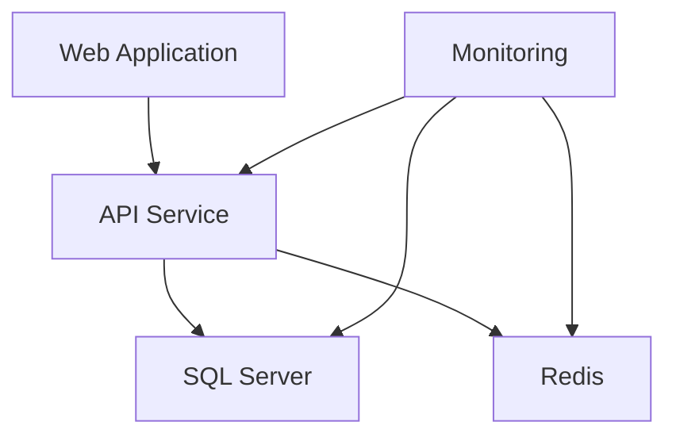

# BPTS Docker Deployment Scripts

This directory contains comprehensive Docker deployment scripts for the BPTS Work Intake System. These scripts provide automated deployment, monitoring, maintenance, and backup capabilities for the containerized application.

## 📁 Directory Structure

```
deployment/docker/
├── Deploy-Docker.ps1           # Main deployment script (✅ WORKING)
├── Health-Check.ps1           # Health monitoring script
├── Monitor-Services.ps1       # Continuous service monitoring
├── Run-Migrations.ps1         # Database migration script
├── Cleanup-Docker.ps1         # Docker resource cleanup
├── Backup-Data.ps1           # Data backup script
├── quick-start.bat           # Windows batch quick start (✅ WORKING)
├── docker-compose.override.yml # Environment-specific overrides
├── env.template              # Environment variables template
├── init-database.sql         # Database initialization script
└── README.md                 # This file
```

## 🚀 Quick Start

### 1. Quick Start Options

```batch
REM Use the Windows batch file for easy deployment
deployment\docker\quick-start.bat
```

```powershell
# Main deployment script (TESTED AND WORKING)
.\deployment\docker\Deploy-Docker.ps1 -Environment Development

# Clean deployment (removes existing containers and volumes)
.\deployment\docker\Deploy-Docker.ps1 -Environment Development -CleanStart -WaitForHealthy

# Production deployment with monitoring
.\deployment\docker\Deploy-Docker.ps1 -Environment Production -Monitoring
```

### 2. Health Monitoring

```powershell
# Quick health check
.\deployment\docker\Health-Check.ps1

# Detailed health check with JSON output
.\deployment\docker\Health-Check.ps1 -Detailed -Json

# Continuous monitoring
.\deployment\docker\Health-Check.ps1 -ContinuousMonitoring -Interval 60
```

### 3. Database Management

```powershell
# Run Entity Framework migrations
.\deployment\docker\Run-Migrations.ps1

# Run migrations for production
.\deployment\docker\Run-Migrations.ps1 -Environment Production
```

## 📋 Detailed Script Documentation

### Deploy-Docker.ps1

**Purpose**: Main deployment script for the entire BPTS system.

**Key Features**:
- Multi-environment support (Development, Staging, Production)
- Automated database initialization
- Health checks and validation
- Monitoring stack integration
- Comprehensive error handling

**Parameters**:
- `-Environment`: Target environment (Development/Staging/Production)
- `-SkipBuild`: Skip image building
- `-SkipDatabase`: Skip database initialization
- `-Monitoring`: Include ELK monitoring stack
- `-CleanStart`: Clean existing containers and volumes
- `-WaitForHealthy`: Wait for all services to be healthy

**Examples**:
```powershell
# Development deployment
.\Deploy-Docker.ps1 -Environment Development

# Production deployment with clean start
.\Deploy-Docker.ps1 -Environment Production -CleanStart -Monitoring

# Quick deployment skipping build
.\Deploy-Docker.ps1 -SkipBuild -WaitForHealthy
```

### Health-Check.ps1

**Purpose**: Comprehensive health monitoring for all services.

**Key Features**:
- HTTP endpoint testing
- Database connectivity checks
- Container health status
- Response time monitoring
- JSON output support
- Continuous monitoring mode

**Parameters**:
- `-Detailed`: Show detailed health information
- `-Json`: Output results in JSON format
- `-ContinuousMonitoring`: Run continuously
- `-Interval`: Check interval in seconds

**Examples**:
```powershell
# Basic health check
.\Health-Check.ps1

# Continuous monitoring every 30 seconds
.\Health-Check.ps1 -ContinuousMonitoring -Interval 30

# Detailed JSON output for integration
.\Health-Check.ps1 -Detailed -Json > health-status.json
```

### Monitor-Services.ps1

**Purpose**: Advanced service monitoring with alerting capabilities.

**Key Features**:
- Real-time service monitoring
- Configurable alert thresholds
- Webhook notifications (Slack, Teams)
- Failure tracking and recovery detection
- System metrics collection
- Log file integration

**Parameters**:
- `-LogFile`: Path to monitoring log file
- `-AlertThreshold`: Failures before alerting
- `-CheckInterval`: Monitoring interval
- `-EmailAlerts`: Enable email notifications
- `-WebhookUrl`: Webhook URL for alerts

**Examples**:
```powershell
# Basic monitoring
.\Monitor-Services.ps1

# Advanced monitoring with Slack alerts
.\Monitor-Services.ps1 -WebhookUrl "https://hooks.slack.com/..." -AlertThreshold 2

# Monitoring with custom log file
.\Monitor-Services.ps1 -LogFile "C:\Logs\bpts-monitoring.log"
```

### Run-Migrations.ps1

**Purpose**: Entity Framework database migration management.

**Key Features**:
- Automated migration execution
- Database connection testing
- Environment-specific configurations
- Migration status verification
- Error handling and rollback support

**Parameters**:
- `-ConnectionString`: Override default connection
- `-Environment`: Target environment

**Examples**:
```powershell
# Run migrations with default settings
.\Run-Migrations.ps1

# Production migrations
.\Run-Migrations.ps1 -Environment Production

# Custom connection string
.\Run-Migrations.ps1 -ConnectionString "Server=...;Database=...;"
```

### Cleanup-Docker.ps1

**Purpose**: Docker resource cleanup and maintenance.

**Key Features**:
- Selective resource cleanup
- Space usage analysis
- Dry-run mode
- Confirmation prompts
- BPTS-specific container handling

**Parameters**:
- `-CleanContainers`: Remove stopped containers
- `-CleanImages`: Remove unused images
- `-CleanVolumes`: Remove unused volumes (DATA LOSS!)
- `-CleanNetworks`: Remove unused networks
- `-CleanAll`: Complete cleanup
- `-Force`: Skip confirmation prompts
- `-DryRun`: Show what would be cleaned

**Examples**:
```powershell
# Interactive cleanup
.\Cleanup-Docker.ps1

# Clean containers and images only
.\Cleanup-Docker.ps1 -CleanContainers -CleanImages

# Complete cleanup with force
.\Cleanup-Docker.ps1 -CleanAll -Force

# Dry run to see what would be cleaned
.\Cleanup-Docker.ps1 -DryRun
```

### Backup-Data.ps1

**Purpose**: Automated backup of database and application data.

**Key Features**:
- SQL Server database backup
- Application files backup
- Compression support
- Automatic retention management
- Backup verification

**Parameters**:
- `-BackupPath`: Backup storage location
- `-BackupType`: Database/Files/All
- `-Compress`: Compress backup files
- `-Retention`: Days to retain backups
- `-DatabaseOnly`: Database backup only
- `-FilesOnly`: Files backup only

**Examples**:
```powershell
# Complete backup
.\Backup-Data.ps1

# Database backup only with compression
.\Backup-Data.ps1 -DatabaseOnly -Compress

# Custom backup location with 30-day retention
.\Backup-Data.ps1 -BackupPath "D:\Backups" -Retention 30
```

## 🔧 Configuration

### Environment Variables

Copy `env.template` to `.env` and customize:

```bash
# Copy template
cp env.template .env

# Edit configuration
notepad .env
```

### Docker Compose Override

The `docker-compose.override.yml` file provides environment-specific configurations:

- Development settings
- Port mappings
- Volume mounts
- Environment variables
- Service dependencies

## 🏗️ Architecture

### Service Dependencies



### Port Mapping

| Service | Internal Port | External Port | Purpose |
|---------|--------------|---------------|---------|
| Web App | 80 | 3000 | React frontend |
| API | 80 | 5000 | .NET Core API |
| API SSL | 443 | 5001 | HTTPS endpoint |
| SQL Server | 1433 | 1433 | Database |
| Redis | 6379 | 6379 | Cache |
| Elasticsearch | 9200 | 9200 | Search/Logging |
| Kibana | 5601 | 5601 | Log visualization |

## 🔍 Troubleshooting

### Common Issues

1. **SQL Server Connection Issues**
   ```powershell
   # Check SQL Server status
   docker logs bpts-sqlserver-1
   
   # Test connection
   docker exec bpts-sqlserver-1 /opt/mssql-tools18/bin/sqlcmd -S localhost -U sa -P "YourStrong@Passw0rd" -C -Q "SELECT 1"
   ```

2. **API Service Crashes**
   ```powershell
   # Check API logs
   docker logs bpts-workintake-api-1
   
   # Restart API service
   docker-compose restart workintake-api
   ```

3. **Web Application Not Loading**
   ```powershell
   # Check web container
   docker logs bpts-workintake-web-1
   
   # Test nginx configuration
   docker exec bpts-workintake-web-1 nginx -t
   ```

4. **Build Context Too Large**
   ```powershell
   # Clean build artifacts
   .\Cleanup-Docker.ps1 -CleanImages -CleanContainers
   
   # Check .dockerignore file
   notepad .dockerignore
   ```

### Health Check Commands

```powershell
# Quick service status
docker-compose ps

# Detailed container inspection
docker inspect bpts-workintake-api-1

# Resource usage
docker stats --no-stream

# System resource usage
docker system df
```

### Log Analysis

```powershell
# Follow all logs
docker-compose logs -f

# Specific service logs
docker-compose logs -f workintake-api

# Last 100 lines
docker-compose logs --tail=100 workintake-api
```

## 🔒 Security Considerations

### Production Deployment

1. **Change Default Passwords**
   - SQL Server SA password
   - JWT signing keys
   - Redis authentication (if enabled)

2. **Network Security**
   - Use custom Docker networks
   - Implement firewall rules
   - Enable SSL/TLS certificates

3. **Secrets Management**
   - Use Docker secrets
   - Environment-specific configurations
   - Avoid hardcoded credentials

### Backup Security

1. **Encrypt Backups**
   - Use encrypted storage
   - Secure backup transmission
   - Access control on backup files

2. **Backup Testing**
   - Regular restore testing
   - Backup integrity verification
   - Recovery time objectives

## 📊 Monitoring and Alerting

### Health Monitoring

- Automated health checks every 30 seconds
- Service availability monitoring
- Response time tracking
- Resource usage monitoring

### Alerting Options

1. **Webhook Notifications**
   - Slack integration
   - Microsoft Teams
   - Custom webhook endpoints

2. **Log-based Monitoring**
   - Structured logging
   - Error aggregation
   - Performance metrics

### Metrics Collection

- Container resource usage
- Database performance
- API response times
- Error rates and patterns

## 🚀 Deployment Best Practices

1. **Pre-deployment**
   - Run health checks
   - Verify configurations
   - Test database connectivity

2. **During Deployment**
   - Monitor deployment progress
   - Watch for error messages
   - Verify service startup

3. **Post-deployment**
   - Run comprehensive health checks
   - Verify application functionality
   - Monitor initial performance

4. **Maintenance**
   - Regular backups
   - Resource cleanup
   - Security updates
   - Performance monitoring

## 📞 Support

For issues or questions:

1. Check the troubleshooting section
2. Review container logs
3. Run health checks
4. Consult the main project documentation

## 📝 License

This deployment configuration is part of the BPTS Work Intake System project.
