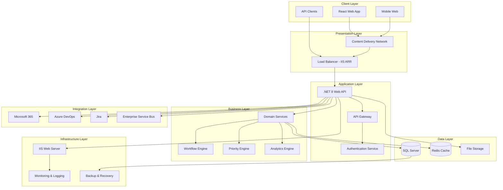
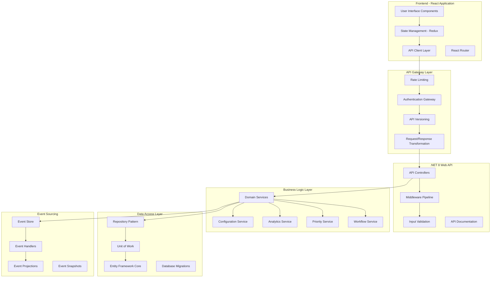
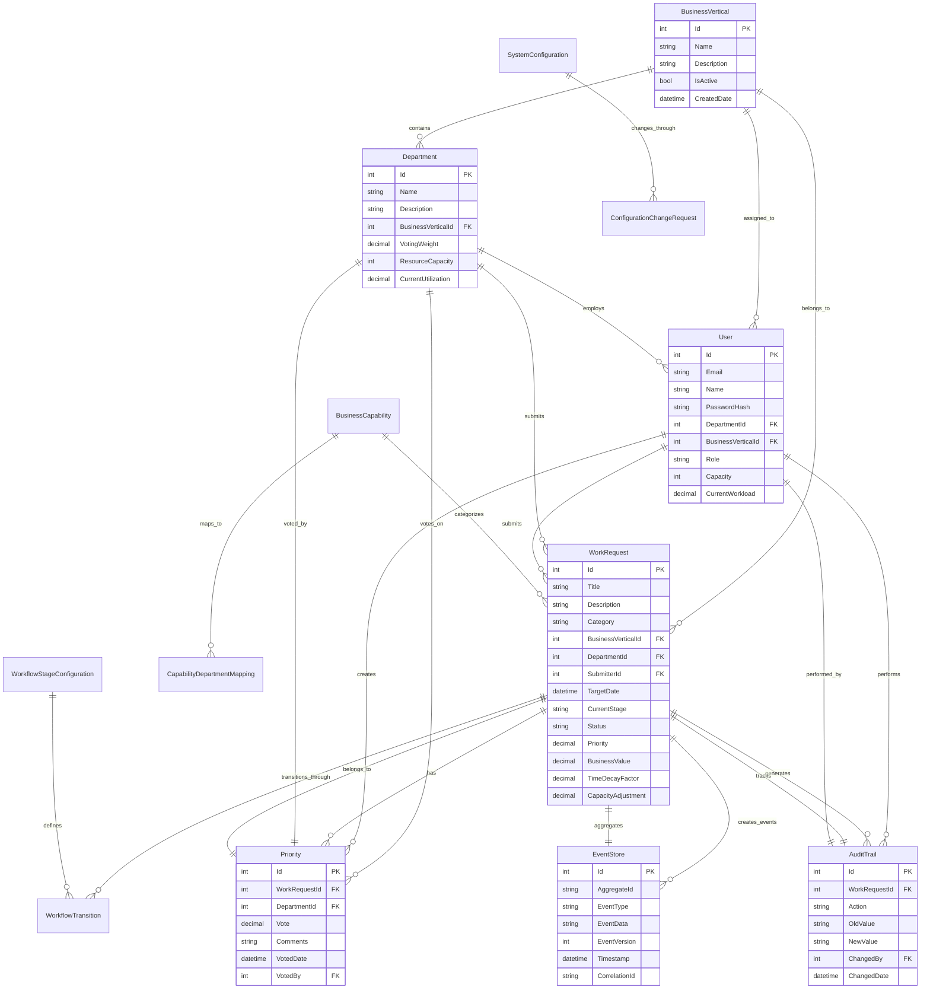
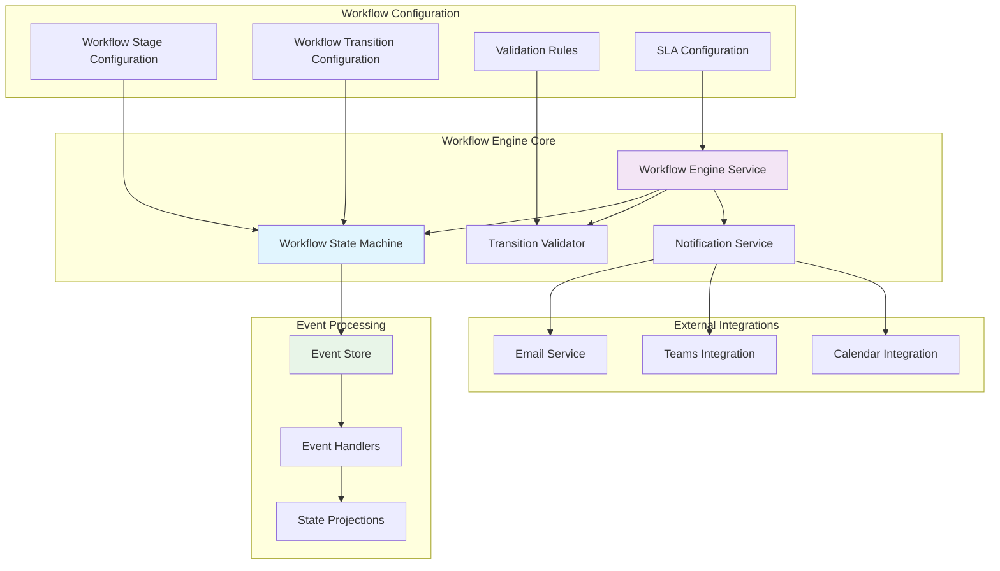
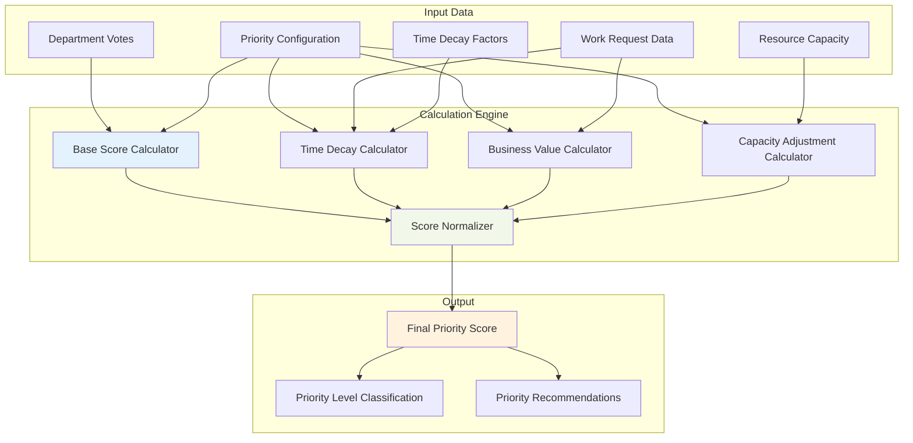
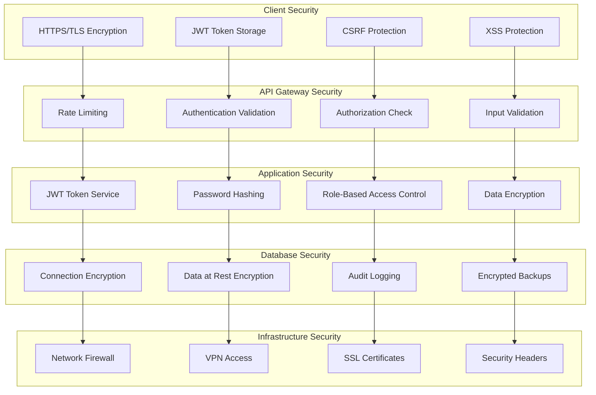
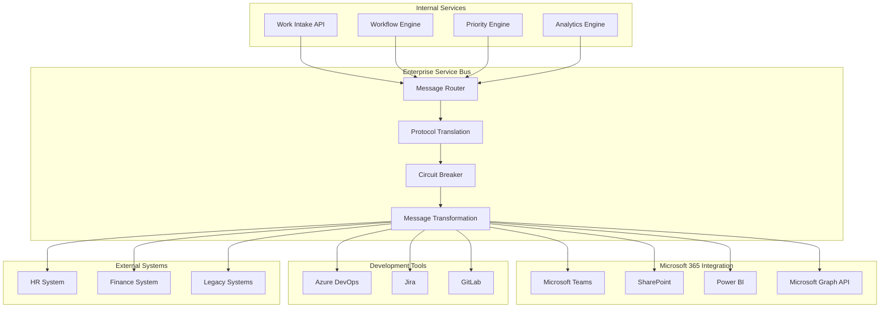
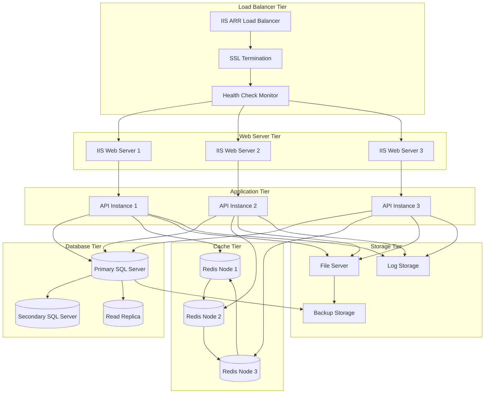
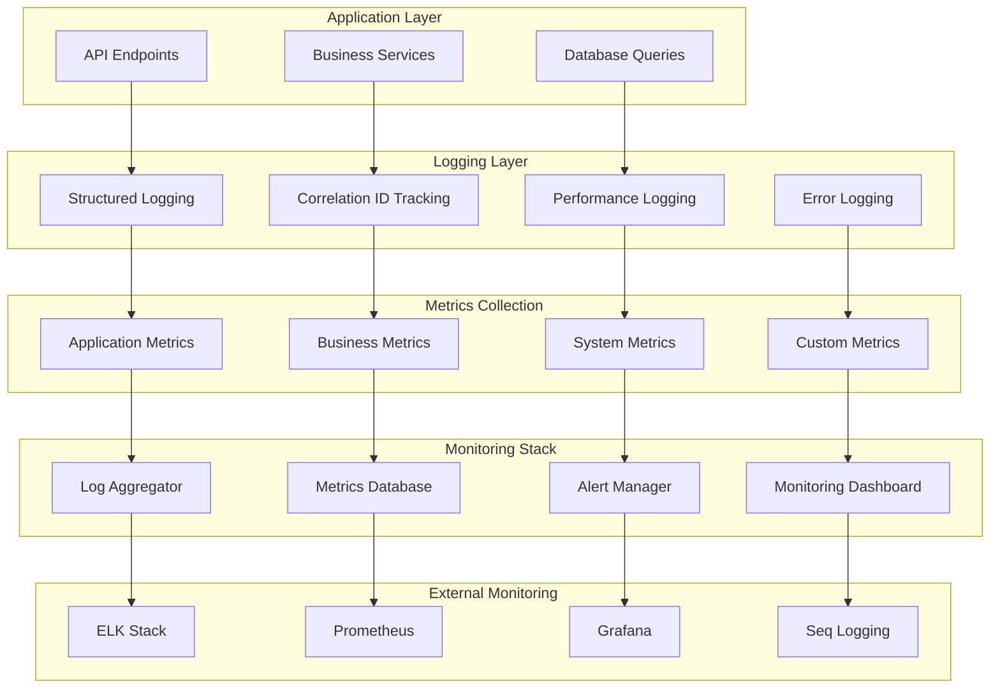
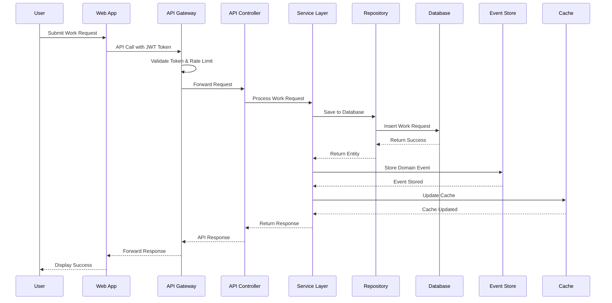

# Architecture Diagrams
## Business Prioritization Tracking System (BPTS)

This document contains detailed architecture diagrams for the BPTS system.

---

## 1. High-Level System Architecture

---

## 2. Detailed Application Architecture

---

## 3. Data Architecture & Entity Relationships

---

## 4. Workflow Engine Architecture

---

## 5. Priority Calculation Engine

---

## 6. Security Architecture

---

## 7. Integration Architecture

---

## 8. Deployment Architecture

---

## 9. Monitoring & Observability Architecture

---

## 10. Data Flow Architecture

---

These diagrams provide a comprehensive visual representation of the BPTS system architecture, covering all major components, data flows, and integration points. Each diagram focuses on a specific aspect of the system to provide clear understanding of the overall design and implementation approach.

