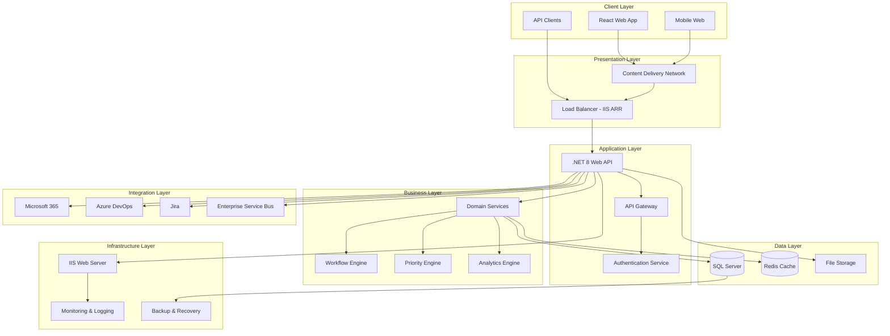

# Detailed Design Document
## Business Prioritization Tracking System (BPTS)

**Version:** 2.0  
**Date:** September 8, 2025  
**Document Owner:** Development Team  
**Reviewers:** Technical Lead, Architecture Team  

---

## 1. Executive Summary

This document provides a comprehensive technical design for the Business Prioritization Tracking System (BPTS), a modern enterprise application built with .NET 8 and React. The system implements advanced architectural patterns including Event Sourcing, CQRS, Domain-Driven Design, and Enterprise Service Bus patterns to deliver a scalable, maintainable, and robust work intake management solution.

### 1.1 Key Design Principles
- **Separation of Concerns:** Clear separation between presentation, business logic, and data layers
- **Domain-Driven Design:** Business logic encapsulated in domain entities and services
- **Event-Driven Architecture:** Event sourcing for audit trails and state reconstruction
- **Microservices-Ready:** Modular design enabling future microservices migration
- **Enterprise Integration:** Comprehensive integration capabilities with external systems

---

## 2. System Architecture Overview

### 2.1 High-Level Architecture



### 2.2 Architectural Layers

#### 2.2.1 Presentation Layer
- **React 18 with TypeScript:** Modern, type-safe frontend development
- **Material-UI:** Enterprise-grade component library
- **State Management:** Redux Toolkit with React Query for server state
- **Responsive Design:** Mobile-first approach with accessibility compliance

#### 2.2.2 Application Layer
- **.NET 8 Web API:** RESTful API with OpenAPI/Swagger documentation
- **API Gateway:** Centralized routing, authentication, and rate limiting
- **JWT Authentication:** Stateless authentication with role-based authorization
- **Middleware Pipeline:** Request/response processing and logging

#### 2.2.3 Business Layer
- **Domain Services:** Core business logic implementation
- **Workflow Engine:** Configurable business process management
- **Priority Engine:** Advanced priority calculation algorithms
- **Analytics Engine:** Business intelligence and reporting

#### 2.2.4 Integration Layer
- **Microsoft 365 Integration:** Teams, SharePoint, Power BI connectivity
- **External Systems:** Azure DevOps, Jira, and other third-party integrations
- **Enterprise Service Bus:** Message routing and protocol translation
- **Event-Driven Communication:** Asynchronous messaging patterns

#### 2.2.5 Data Layer
- **SQL Server:** Primary data store with Always On Availability Groups
- **Redis Cache:** Distributed caching and session management
- **Event Store:** Immutable event log for audit trails
- **File Storage:** Document and attachment management

---

## 3. Detailed Component Design

### 3.1 Frontend Architecture

#### 3.1.1 React Application Structure
```
src/
├── components/           # Reusable UI components
│   ├── Layout/          # Layout components
│   ├── Forms/           # Form components
│   ├── Tables/          # Data table components
│   └── Charts/          # Chart components
├── pages/               # Page components
│   ├── Dashboard/       # Dashboard pages
│   ├── WorkRequests/    # Work request pages
│   ├── Analytics/       # Analytics pages
│   └── Administration/  # Admin pages
├── services/            # API services
│   ├── api.ts          # API client
│   ├── auth.ts         # Authentication service
│   └── analytics.ts    # Analytics service
├── store/              # State management
│   ├── slices/         # Redux slices
│   └── middleware/     # Custom middleware
├── types/              # TypeScript definitions
└── utils/              # Utility functions
```

#### 3.1.2 Component Design Patterns
- **Container/Presentational Pattern:** Separation of logic and presentation
- **Higher-Order Components:** Cross-cutting concerns like authentication
- **Custom Hooks:** Reusable stateful logic
- **Context Providers:** Global state management

### 3.2 Backend Architecture

#### 3.2.1 API Layer Design
```csharp
// API Controller Structure
[ApiController]
[Route("api/[controller]")]
[Authorize]
public class WorkRequestsController : ControllerBase
{
    private readonly IWorkRequestService _workRequestService;
    private readonly IWorkflowEngine _workflowEngine;
    private readonly IPriorityCalculationService _priorityService;
    
    // RESTful endpoints with proper HTTP verbs
    [HttpGet]           // GET /api/workrequests
    [HttpGet("{id}")]   // GET /api/workrequests/{id}
    [HttpPost]          // POST /api/workrequests
    [HttpPut("{id}")]   // PUT /api/workrequests/{id}
    [HttpDelete("{id}")] // DELETE /api/workrequests/{id}
}
```

#### 3.2.2 Service Layer Architecture
```csharp
// Domain Service Interface
public interface IWorkRequestService
{
    Task<WorkRequest> CreateWorkRequestAsync(CreateWorkRequestDto dto);
    Task<WorkRequest> UpdateWorkRequestAsync(int id, UpdateWorkRequestDto dto);
    Task<bool> AdvanceWorkflowAsync(int workRequestId, string targetStage);
    Task<decimal> CalculatePriorityAsync(int workRequestId);
}

// Service Implementation
public class WorkRequestService : IWorkRequestService
{
    private readonly IWorkRequestRepository _repository;
    private readonly IWorkflowEngine _workflowEngine;
    private readonly IEventStore _eventStore;
    private readonly ILogger<WorkRequestService> _logger;
    
    // Implementation with dependency injection
}
```

#### 3.2.3 Repository Pattern
```csharp
// Generic Repository Interface
public interface IRepository<T> where T : BaseEntity
{
    Task<T?> GetByIdAsync(int id);
    Task<IEnumerable<T>> GetAllAsync();
    Task<T> AddAsync(T entity);
    Task<T> UpdateAsync(T entity);
    Task<bool> DeleteAsync(int id);
}

// Specific Repository Implementation
public class WorkRequestRepository : Repository<WorkRequest>, IWorkRequestRepository
{
    private readonly WorkIntakeDbContext _context;
    
    public WorkRequestRepository(WorkIntakeDbContext context) : base(context)
    {
        _context = context;
    }
    
    // Custom repository methods
    public async Task<IEnumerable<WorkRequest>> GetByDepartmentAsync(int departmentId)
    {
        return await _context.WorkRequests
            .Include(w => w.Department)
            .Include(w => w.Submitter)
            .Where(w => w.DepartmentId == departmentId)
            .ToListAsync();
    }
}
```

### 3.3 Data Architecture

#### 3.3.1 Entity Framework Core Design
```csharp
// DbContext Configuration
public class WorkIntakeDbContext : DbContext
{
    public DbSet<WorkRequest> WorkRequests { get; set; }
    public DbSet<User> Users { get; set; }
    public DbSet<Department> Departments { get; set; }
    public DbSet<BusinessVertical> BusinessVerticals { get; set; }
    public DbSet<EventStore> EventStore { get; set; }
    public DbSet<AuditTrail> AuditTrails { get; set; }
    
    protected override void OnModelCreating(ModelBuilder modelBuilder)
    {
        // Fluent API configuration
        modelBuilder.Entity<WorkRequest>(entity =>
        {
            entity.HasKey(e => e.Id);
            entity.Property(e => e.Priority).HasColumnType("decimal(3,2)");
            entity.HasOne(e => e.Department)
                  .WithMany(d => d.WorkRequests)
                  .HasForeignKey(e => e.DepartmentId);
        });
    }
}
```

#### 3.3.2 Database Schema Design

##### Core Tables
```sql
-- Work Requests Table
CREATE TABLE WorkRequests (
    Id INT IDENTITY(1,1) PRIMARY KEY,
    Title NVARCHAR(200) NOT NULL,
    Description NVARCHAR(MAX) NOT NULL,
    Category NVARCHAR(50) NOT NULL,
    BusinessVerticalId INT NOT NULL,
    DepartmentId INT NOT NULL,
    SubmitterId INT NOT NULL,
    TargetDate DATETIME2,
    ActualDate DATETIME2,
    CurrentStage NVARCHAR(50) NOT NULL,
    Status NVARCHAR(50) NOT NULL,
    Priority DECIMAL(3,2) DEFAULT 0.0,
    BusinessValue DECIMAL(3,2) DEFAULT 0.5,
    TimeDecayFactor DECIMAL(3,2) DEFAULT 1.0,
    CapacityAdjustment DECIMAL(3,2) DEFAULT 1.0,
    CreatedDate DATETIME2 NOT NULL,
    ModifiedDate DATETIME2 NOT NULL,
    CreatedBy NVARCHAR(100) NOT NULL,
    ModifiedBy NVARCHAR(100) NOT NULL,
    IsActive BIT DEFAULT 1
);

-- Event Store Table
CREATE TABLE EventStore (
    Id INT IDENTITY(1,1) PRIMARY KEY,
    AggregateId NVARCHAR(50) NOT NULL,
    EventType NVARCHAR(100) NOT NULL,
    EventData NVARCHAR(MAX) NOT NULL,
    EventVersion INT NOT NULL DEFAULT 1,
    Timestamp DATETIME2 NOT NULL,
    CorrelationId NVARCHAR(50),
    CausationId NVARCHAR(50),
    CreatedBy NVARCHAR(100) NOT NULL,
    Metadata NVARCHAR(MAX)
);
```

### 3.4 Event Sourcing Architecture

#### 3.4.1 Event Store Implementation
```csharp
// Event Interface
public interface IDomainEvent
{
    string EventType { get; }
    DateTime Timestamp { get; }
    string AggregateId { get; }
    int EventVersion { get; }
    string CorrelationId { get; }
}

// Domain Event Implementation
public class WorkRequestCreatedEvent : IDomainEvent
{
    public string EventType => "WorkRequestCreated";
    public DateTime Timestamp { get; } = DateTime.UtcNow;
    public string AggregateId { get; }
    public int EventVersion { get; }
    public string CorrelationId { get; }
    
    public string Title { get; }
    public string Description { get; }
    public int DepartmentId { get; }
    public int SubmitterId { get; }
    
    public WorkRequestCreatedEvent(int workRequestId, string title, string description, 
        int departmentId, int submitterId, string correlationId)
    {
        AggregateId = workRequestId.ToString();
        Title = title;
        Description = description;
        DepartmentId = departmentId;
        SubmitterId = submitterId;
        CorrelationId = correlationId;
    }
}
```

#### 3.4.2 Event Handler Pattern
```csharp
// Event Handler Interface
public interface IEventHandler<T> where T : IDomainEvent
{
    Task HandleAsync(T domainEvent);
}

// Audit Trail Event Handler
public class AuditTrailEventHandler : IEventHandler<WorkRequestCreatedEvent>
{
    private readonly IAuditTrailRepository _auditRepository;
    private readonly ILogger<AuditTrailEventHandler> _logger;
    
    public async Task HandleAsync(WorkRequestCreatedEvent domainEvent)
    {
        var auditEntry = new AuditTrail
        {
            EntityType = "WorkRequest",
            EntityId = int.Parse(domainEvent.AggregateId),
            Action = "Created",
            OldValue = null,
            NewValue = JsonSerializer.Serialize(domainEvent),
            ChangedBy = domainEvent.CorrelationId,
            ChangedDate = domainEvent.Timestamp
        };
        
        await _auditRepository.AddAsync(auditEntry);
        _logger.LogInformation("Audit trail created for work request {WorkRequestId}", 
            domainEvent.AggregateId);
    }
}
```

### 3.5 Workflow Engine Design

#### 3.5.1 Workflow Configuration
```csharp
// Workflow Stage Configuration
public class WorkflowStageConfiguration : BaseEntity
{
    public string Name { get; set; } = string.Empty;
    public int Order { get; set; }
    public string Description { get; set; } = string.Empty;
    public int BusinessVerticalId { get; set; }
    public string RequiredRoles { get; set; } = string.Empty; // JSON array
    public bool ApprovalRequired { get; set; }
    public bool IsActive { get; set; }
    public int SLAHours { get; set; }
    public string NotificationTemplate { get; set; } = string.Empty;
    public bool AutoTransition { get; set; }
    public string AllowedTransitions { get; set; } = string.Empty; // JSON array
    public string ValidationRules { get; set; } = string.Empty; // JSON array
}

// Workflow Engine Interface
public interface IWorkflowEngine
{
    Task<bool> CanTransitionAsync(int workRequestId, string targetStage);
    Task<bool> TransitionAsync(int workRequestId, string targetStage, string userId);
    Task<IEnumerable<string>> GetAvailableTransitionsAsync(int workRequestId);
    Task<bool> ValidateTransitionAsync(int workRequestId, string targetStage);
}
```

#### 3.5.2 Workflow State Machine
```csharp
// Workflow State Machine Implementation
public class WorkflowStateMachine
{
    private readonly Dictionary<string, WorkflowStage> _stages;
    private readonly Dictionary<string, List<string>> _transitions;
    
    public WorkflowStateMachine(IEnumerable<WorkflowStageConfiguration> configurations)
    {
        _stages = configurations.ToDictionary(c => c.Name, c => new WorkflowStage(c));
        _transitions = BuildTransitionMap(configurations);
    }
    
    public bool CanTransition(string fromStage, string toStage)
    {
        return _transitions.ContainsKey(fromStage) && 
               _transitions[fromStage].Contains(toStage);
    }
    
    public IEnumerable<string> GetAvailableTransitions(string currentStage)
    {
        return _transitions.ContainsKey(currentStage) 
            ? _transitions[currentStage] 
            : Enumerable.Empty<string>();
    }
}
```

### 3.6 Priority Calculation Engine

#### 3.6.1 Priority Algorithm Design
```csharp
// Priority Calculation Service
public class PriorityCalculationService : IPriorityCalculationService
{
    private readonly IConfigurationService _configService;
    private readonly ILogger<PriorityCalculationService> _logger;
    
    public async Task<decimal> CalculatePriorityAsync(int workRequestId)
    {
        var workRequest = await GetWorkRequestAsync(workRequestId);
        var departmentVotes = await GetDepartmentVotesAsync(workRequestId);
        var configuration = await _configService.GetPriorityConfigurationAsync(
            workRequest.BusinessVerticalId);
        
        // Base Priority Score Calculation
        var baseScore = CalculateBaseScore(departmentVotes, configuration);
        
        // Enhanced Priority Score with Factors
        var enhancedScore = baseScore * 
            CalculateTimeDecayFactor(workRequest.CreatedDate, configuration) *
            workRequest.BusinessValue *
            CalculateCapacityAdjustment(workRequest.DepartmentId, configuration);
        
        // Normalize to 0-1 scale
        var normalizedScore = Math.Min(Math.Max(enhancedScore, 0), 1);
        
        return normalizedScore;
    }
    
    private decimal CalculateBaseScore(IEnumerable<PriorityVote> votes, 
        PriorityConfiguration config)
    {
        var weightedSum = votes.Sum(v => v.Vote * v.Department.Weight);
        var totalWeight = votes.Sum(v => v.Department.Weight);
        
        return totalWeight > 0 ? weightedSum / totalWeight : 0;
    }
    
    private decimal CalculateTimeDecayFactor(DateTime createdDate, 
        PriorityConfiguration config)
    {
        var daysOld = (DateTime.UtcNow - createdDate).Days;
        var decayRate = config.TimeDecayRate;
        
        return 1 + (daysOld * decayRate);
    }
}
```

---

## 4. Integration Architecture

### 4.1 Microsoft 365 Integration

#### 4.1.1 Teams Integration
```csharp
// Microsoft 365 Service Interface
public interface IMicrosoft365Service
{
    Task<bool> CreateTeamsChannelAsync(string teamId, string channelName, string description);
    Task<bool> SendTeamsNotificationAsync(string channelId, string message);
    Task<IEnumerable<TeamsChannel>> GetTeamsChannelsAsync(string teamId);
}

// Teams Integration Implementation
public class Microsoft365Service : IMicrosoft365Service
{
    private readonly GraphServiceClient _graphClient;
    private readonly IConfiguration _configuration;
    
    public async Task<bool> CreateTeamsChannelAsync(string teamId, string channelName, string description)
    {
        try
        {
            var channel = new Channel
            {
                DisplayName = channelName,
                Description = description,
                MembershipType = ChannelMembershipType.Standard
            };
            
            await _graphClient.Teams[teamId].Channels.Request().AddAsync(channel);
            return true;
        }
        catch (Exception ex)
        {
            _logger.LogError(ex, "Failed to create Teams channel {ChannelName}", channelName);
            return false;
        }
    }
}
```

#### 4.1.2 SharePoint Integration
```csharp
// SharePoint Document Management
public class SharePointService : ISharePointService
{
    private readonly GraphServiceClient _graphClient;
    
    public async Task<string> CreateDocumentLibraryAsync(string siteId, string libraryName)
    {
        var documentLibrary = new DocumentLibrary
        {
            Name = libraryName,
            DisplayName = libraryName
        };
        
        var createdLibrary = await _graphClient.Sites[siteId].Lists.Request()
            .AddAsync(documentLibrary);
            
        return createdLibrary.Id;
    }
    
    public async Task<string> UploadDocumentAsync(string siteId, string libraryId, 
        string fileName, Stream fileStream)
    {
        var driveItem = await _graphClient.Sites[siteId].Lists[libraryId].Drive.Root
            .ItemWithPath(fileName).Content.Request().PutAsync(fileStream);
            
        return driveItem.Id;
    }
}
```

### 4.2 External System Integration

#### 4.2.1 Azure DevOps Integration
```csharp
// Azure DevOps Integration Service
public class AzureDevOpsService : IDevOpsIntegrationService
{
    private readonly HttpClient _httpClient;
    private readonly IConfiguration _configuration;
    
    public async Task<string> CreateWorkItemAsync(CreateWorkItemRequest request)
    {
        var workItem = new
        {
            fields = new
            {
                ["System.Title"] = request.Title,
                ["System.Description"] = request.Description,
                ["System.WorkItemType"] = request.WorkItemType,
                ["System.AreaPath"] = request.AreaPath,
                ["System.IterationPath"] = request.IterationPath
            }
        };
        
        var json = JsonSerializer.Serialize(new[] { workItem });
        var content = new StringContent(json, Encoding.UTF8, "application/json-patch+json");
        
        var response = await _httpClient.PostAsync($"/_apis/wit/workitems/${request.WorkItemType}", content);
        response.EnsureSuccessStatusCode();
        
        var result = await response.Content.ReadFromJsonAsync<WorkItemResponse>();
        return result.Value.Id.ToString();
    }
}
```

#### 4.2.2 Enterprise Service Bus
```csharp
// Enterprise Service Bus Implementation
public class EnterpriseServiceBus : IEnterpriseServiceBus
{
    private readonly IMessageQueue _messageQueue;
    private readonly IMessageRouter _messageRouter;
    private readonly IMessageTransformer _messageTransformer;
    
    public async Task PublishAsync<T>(T message, string topic) where T : class
    {
        var envelope = new MessageEnvelope<T>
        {
            MessageId = Guid.NewGuid().ToString(),
            Topic = topic,
            Payload = message,
            Timestamp = DateTime.UtcNow,
            CorrelationId = GetCorrelationId()
        };
        
        await _messageQueue.PublishAsync(envelope);
    }
    
    public async Task SubscribeAsync<T>(string topic, Func<T, Task> handler) where T : class
    {
        await _messageQueue.SubscribeAsync<T>(topic, async (envelope) =>
        {
            try
            {
                await handler(envelope.Payload);
            }
            catch (Exception ex)
            {
                _logger.LogError(ex, "Error processing message {MessageId}", envelope.MessageId);
                throw;
            }
        });
    }
}
```

---

## 5. Security Architecture

### 5.1 Authentication & Authorization

#### 5.1.1 JWT Token Implementation
```csharp
// JWT Token Service
public class JwtTokenService : IJwtTokenService
{
    private readonly IConfiguration _configuration;
    private readonly IUserRepository _userRepository;
    
    public async Task<string> GenerateTokenAsync(User user)
    {
        var key = new SymmetricSecurityKey(Encoding.UTF8.GetBytes(_configuration["Jwt:Key"]));
        var credentials = new SigningCredentials(key, SecurityAlgorithms.HmacSha256);
        
        var claims = new List<Claim>
        {
            new(ClaimTypes.NameIdentifier, user.Id.ToString()),
            new(ClaimTypes.Email, user.Email),
            new(ClaimTypes.Name, user.Name),
            new(ClaimTypes.Role, user.Role.ToString())
        };
        
        // Add department and business vertical claims
        claims.Add(new Claim("DepartmentId", user.DepartmentId.ToString()));
        claims.Add(new Claim("BusinessVerticalId", user.BusinessVerticalId.ToString()));
        
        var token = new JwtSecurityToken(
            issuer: _configuration["Jwt:Issuer"],
            audience: _configuration["Jwt:Audience"],
            claims: claims,
            expires: DateTime.UtcNow.AddHours(8),
            signingCredentials: credentials
        );
        
        return new JwtSecurityTokenHandler().WriteToken(token);
    }
}
```

#### 5.1.2 Role-Based Authorization
```csharp
// Custom Authorization Handler
public class PermissionAuthorizationHandler : AuthorizationHandler<PermissionRequirement>
{
    private readonly IUserRepository _userRepository;
    private readonly ILogger<PermissionAuthorizationHandler> _logger;
    
    protected override async Task HandleRequirementAsync(
        AuthorizationHandlerContext context,
        PermissionRequirement requirement)
    {
        var userIdClaim = context.User.FindFirst(ClaimTypes.NameIdentifier);
        if (userIdClaim == null || !int.TryParse(userIdClaim.Value, out var userId))
        {
            context.Fail();
            return;
        }
        
        var user = await _userRepository.GetByIdAsync(userId);
        if (user == null)
        {
            context.Fail();
            return;
        }
        
        if (HasPermission(user, requirement.Permission))
        {
            context.Succeed(requirement);
        }
        else
        {
            context.Fail();
        }
    }
    
    private bool HasPermission(User user, string permission)
    {
        return user.Role switch
        {
            UserRole.SystemAdministrator => true, // System admin has all permissions
            UserRole.BusinessExecutive => IsExecutivePermission(permission),
            UserRole.DepartmentHead => IsDepartmentHeadPermission(permission),
            UserRole.DepartmentManager => IsManagerPermission(permission),
            UserRole.Lead => IsLeadPermission(permission),
            UserRole.EndUser => IsEndUserPermission(permission),
            _ => false
        };
    }
}
```

### 5.2 Data Security

#### 5.2.1 Data Encryption
```csharp
// Data Encryption Service
public class DataEncryptionService : IDataEncryptionService
{
    private readonly byte[] _encryptionKey;
    private readonly ILogger<DataEncryptionService> _logger;
    
    public DataEncryptionService(IConfiguration configuration)
    {
        _encryptionKey = Convert.FromBase64String(configuration["Encryption:Key"]);
    }
    
    public string EncryptSensitiveData(string plainText)
    {
        if (string.IsNullOrEmpty(plainText))
            return plainText;
            
        using var aes = Aes.Create();
        aes.Key = _encryptionKey;
        aes.GenerateIV();
        
        using var encryptor = aes.CreateEncryptor();
        using var msEncrypt = new MemoryStream();
        using var csEncrypt = new CryptoStream(msEncrypt, encryptor, CryptoStreamMode.Write);
        using var swEncrypt = new StreamWriter(csEncrypt);
        
        swEncrypt.Write(plainText);
        swEncrypt.Close();
        
        var encrypted = msEncrypt.ToArray();
        var result = new byte[aes.IV.Length + encrypted.Length];
        Buffer.BlockCopy(aes.IV, 0, result, 0, aes.IV.Length);
        Buffer.BlockCopy(encrypted, 0, result, aes.IV.Length, encrypted.Length);
        
        return Convert.ToBase64String(result);
    }
}
```

---

## 6. Performance & Scalability Design

### 6.1 Caching Strategy

#### 6.1.1 Multi-Tier Caching
```csharp
// Caching Service Implementation
public class CachingService : ICachingService
{
    private readonly IMemoryCache _memoryCache;
    private readonly IDistributedCache _distributedCache;
    private readonly ILogger<CachingService> _logger;
    
    public async Task<T?> GetAsync<T>(string key) where T : class
    {
        // Try memory cache first
        if (_memoryCache.TryGetValue(key, out T? cachedValue))
        {
            return cachedValue;
        }
        
        // Try distributed cache
        var distributedValue = await _distributedCache.GetStringAsync(key);
        if (distributedValue != null)
        {
            var deserializedValue = JsonSerializer.Deserialize<T>(distributedValue);
            if (deserializedValue != null)
            {
                // Store in memory cache for faster access
                _memoryCache.Set(key, deserializedValue, TimeSpan.FromMinutes(5));
                return deserializedValue;
            }
        }
        
        return null;
    }
    
    public async Task SetAsync<T>(string key, T value, TimeSpan? expiration = null) where T : class
    {
        var serializedValue = JsonSerializer.Serialize(value);
        var options = new DistributedCacheEntryOptions
        {
            AbsoluteExpirationRelativeToNow = expiration ?? TimeSpan.FromHours(1)
        };
        
        await _distributedCache.SetStringAsync(key, serializedValue, options);
        
        // Also store in memory cache
        _memoryCache.Set(key, value, TimeSpan.FromMinutes(5));
    }
}
```

#### 6.1.2 Cache Invalidation Strategy
```csharp
// Cache Invalidation Service
public class CacheInvalidationService : ICacheInvalidationService
{
    private readonly ICachingService _cachingService;
    private readonly IEventStore _eventStore;
    
    public async Task InvalidateWorkRequestCacheAsync(int workRequestId)
    {
        var patterns = new[]
        {
            $"workrequest:{workRequestId}",
            $"workrequest:department:*",
            $"workrequest:user:*",
            $"dashboard:*",
            $"analytics:*"
        };
        
        foreach (var pattern in patterns)
        {
            await _cachingService.RemovePatternAsync(pattern);
        }
    }
    
    public async Task InvalidateUserCacheAsync(int userId)
    {
        await _cachingService.RemoveAsync($"user:{userId}");
        await _cachingService.RemoveAsync($"user:permissions:{userId}");
        await _cachingService.RemovePatternAsync($"dashboard:user:{userId}:*");
    }
}
```

### 6.2 Database Optimization

#### 6.2.1 Query Optimization
```csharp
// Optimized Repository Methods
public class OptimizedWorkRequestRepository : IWorkRequestRepository
{
    private readonly WorkIntakeDbContext _context;
    
    public async Task<PagedResult<WorkRequest>> GetWorkRequestsPagedAsync(
        WorkRequestFilter filter, int page, int pageSize)
    {
        var query = _context.WorkRequests
            .AsNoTracking() // Read-only queries don't need change tracking
            .Include(w => w.Department)
            .Include(w => w.Submitter)
            .Include(w => w.BusinessVertical)
            .AsQueryable();
        
        // Apply filters efficiently
        if (filter.DepartmentId.HasValue)
            query = query.Where(w => w.DepartmentId == filter.DepartmentId.Value);
        
        if (filter.Status.HasValue)
            query = query.Where(w => w.Status == filter.Status.Value);
        
        if (filter.PriorityLevel.HasValue)
            query = query.Where(w => w.PriorityLevel == filter.PriorityLevel.Value);
        
        // Apply sorting
        query = filter.SortBy switch
        {
            "priority" => query.OrderByDescending(w => w.Priority),
            "created" => query.OrderByDescending(w => w.CreatedDate),
            "title" => query.OrderBy(w => w.Title),
            _ => query.OrderByDescending(w => w.CreatedDate)
        };
        
        var totalCount = await query.CountAsync();
        var items = await query
            .Skip((page - 1) * pageSize)
            .Take(pageSize)
            .ToListAsync();
        
        return new PagedResult<WorkRequest>
        {
            Items = items,
            TotalCount = totalCount,
            Page = page,
            PageSize = pageSize
        };
    }
}
```

#### 6.2.2 Database Indexing Strategy
```sql
-- Optimized Database Indexes
-- Work Requests Table Indexes
CREATE NONCLUSTERED INDEX IX_WorkRequests_DepartmentId_Status 
ON WorkRequests (DepartmentId, Status) 
INCLUDE (Title, Priority, CreatedDate);

CREATE NONCLUSTERED INDEX IX_WorkRequests_SubmitterId_CreatedDate 
ON WorkRequests (SubmitterId, CreatedDate) 
INCLUDE (Title, Status, Priority);

CREATE NONCLUSTERED INDEX IX_WorkRequests_Priority_Status 
ON WorkRequests (Priority DESC, Status) 
INCLUDE (Title, DepartmentId, CreatedDate);

-- Event Store Table Indexes
CREATE NONCLUSTERED INDEX IX_EventStore_AggregateId_Version 
ON EventStore (AggregateId, EventVersion);

CREATE NONCLUSTERED INDEX IX_EventStore_Timestamp 
ON EventStore (Timestamp) 
INCLUDE (AggregateId, EventType);

-- Users Table Indexes
CREATE NONCLUSTERED INDEX IX_Users_Email 
ON Users (Email) 
INCLUDE (Id, Name, Role, IsActive);

CREATE NONCLUSTERED INDEX IX_Users_DepartmentId_Role 
ON Users (DepartmentId, Role) 
INCLUDE (Id, Name, Email);
```

---

## 7. Monitoring & Observability

### 7.1 Logging Strategy

#### 7.1.1 Structured Logging
```csharp
// Structured Logging Implementation
public class StructuredLogger : IStructuredLogger
{
    private readonly ILogger<StructuredLogger> _logger;
    
    public void LogWorkRequestCreated(int workRequestId, string title, int departmentId, string userId)
    {
        _logger.LogInformation("Work request created: {WorkRequestId}, Title: {Title}, Department: {DepartmentId}, User: {UserId}",
            workRequestId, title, departmentId, userId);
    }
    
    public void LogWorkflowTransition(int workRequestId, string fromStage, string toStage, string userId)
    {
        _logger.LogInformation("Workflow transition: {WorkRequestId}, From: {FromStage}, To: {ToStage}, User: {UserId}",
            workRequestId, fromStage, toStage, userId);
    }
    
    public void LogPerformanceMetric(string operation, long durationMs, string userId = null)
    {
        _logger.LogInformation("Performance metric: {Operation}, Duration: {DurationMs}ms, User: {UserId}",
            operation, durationMs, userId);
    }
}
```

#### 7.1.2 Correlation ID Tracking
```csharp
// Correlation ID Middleware
public class CorrelationIdMiddleware
{
    private readonly RequestDelegate _next;
    private readonly ILogger<CorrelationIdMiddleware> _logger;
    
    public async Task InvokeAsync(HttpContext context)
    {
        var correlationId = context.Request.Headers["X-Correlation-ID"].FirstOrDefault() 
            ?? Guid.NewGuid().ToString();
        
        context.Items["CorrelationId"] = correlationId;
        context.Response.Headers["X-Correlation-ID"] = correlationId;
        
        using (_logger.BeginScope(new Dictionary<string, object>
        {
            ["CorrelationId"] = correlationId
        }))
        {
            await _next(context);
        }
    }
}
```

### 7.2 Health Checks

#### 7.2.1 Comprehensive Health Monitoring
```csharp
// Health Check Services
public class DatabaseHealthCheck : IHealthCheck
{
    private readonly WorkIntakeDbContext _context;
    
    public async Task<HealthCheckResult> CheckHealthAsync(HealthCheckContext context, 
        CancellationToken cancellationToken = default)
    {
        try
        {
            await _context.Database.CanConnectAsync(cancellationToken);
            return HealthCheckResult.Healthy("Database connection is healthy");
        }
        catch (Exception ex)
        {
            return HealthCheckResult.Unhealthy("Database connection failed", ex);
        }
    }
}

public class RedisHealthCheck : IHealthCheck
{
    private readonly IDistributedCache _cache;
    
    public async Task<HealthCheckResult> CheckHealthAsync(HealthCheckContext context, 
        CancellationToken cancellationToken = default)
    {
        try
        {
            await _cache.GetStringAsync("health-check", cancellationToken);
            return HealthCheckResult.Healthy("Redis connection is healthy");
        }
        catch (Exception ex)
        {
            return HealthCheckResult.Unhealthy("Redis connection failed", ex);
        }
    }
}
```

---

## 8. Deployment Architecture

### 8.1 IIS Deployment Configuration

#### 8.1.1 Web.config Configuration
```xml
<?xml version="1.0" encoding="utf-8"?>
<configuration>
  <system.webServer>
    <handlers>
      <add name="aspNetCore" path="*" verb="*" modules="AspNetCoreModuleV2" resourceType="Unspecified" />
    </handlers>
    <aspNetCore processPath="dotnet" arguments=".\WorkIntakeSystem.API.dll" stdoutLogEnabled="false" stdoutLogFile=".\logs\stdout" hostingModel="inprocess">
      <environmentVariables>
        <environmentVariable name="ASPNETCORE_ENVIRONMENT" value="Production" />
      </environmentVariables>
    </aspNetCore>
    
    <!-- Compression -->
    <httpCompression>
      <dynamicTypes>
        <add mimeType="application/json" enabled="true" />
        <add mimeType="application/javascript" enabled="true" />
        <add mimeType="text/css" enabled="true" />
      </dynamicTypes>
    </httpCompression>
    
    <!-- Security Headers -->
    <httpProtocol>
      <customHeaders>
        <add name="X-Content-Type-Options" value="nosniff" />
        <add name="X-Frame-Options" value="DENY" />
        <add name="X-XSS-Protection" value="1; mode=block" />
        <add name="Strict-Transport-Security" value="max-age=31536000; includeSubDomains" />
      </customHeaders>
    </httpProtocol>
    
    <!-- Rewrite Rules -->
    <rewrite>
      <rules>
        <rule name="SPA Routes" stopProcessing="true">
          <match url=".*" />
          <conditions logicalGrouping="MatchAll">
            <add input="{REQUEST_FILENAME}" matchType="IsFile" negate="true" />
            <add input="{REQUEST_FILENAME}" matchType="IsDirectory" negate="true" />
            <add input="{REQUEST_URI}" pattern="^/(api)" negate="true" />
          </conditions>
          <action type="Rewrite" url="/" />
        </rule>
      </rules>
    </rewrite>
  </system.webServer>
</configuration>
```

#### 8.1.2 Load Balancing Configuration
```xml
<!-- Application Request Routing (ARR) Configuration -->
<system.webServer>
  <rewrite>
    <rules>
      <rule name="ARR_LoadBalance" enabled="true" patternSyntax="Wildcard" stopProcessing="true">
        <match url="*" />
        <action type="Rewrite" url="http://appserver1/{R:0}" />
      </rule>
    </rules>
  </rewrite>
</system.webServer>
```

### 8.2 Docker Deployment (Optional)

#### 8.2.1 Dockerfile Configuration
```dockerfile
# Multi-stage build for .NET API
FROM mcr.microsoft.com/dotnet/aspnet:8.0 AS base
WORKDIR /app
EXPOSE 80
EXPOSE 443

FROM mcr.microsoft.com/dotnet/sdk:8.0 AS build
WORKDIR /src
COPY ["WorkIntakeSystem.API/WorkIntakeSystem.API.csproj", "WorkIntakeSystem.API/"]
COPY ["WorkIntakeSystem.Core/WorkIntakeSystem.Core.csproj", "WorkIntakeSystem.Core/"]
COPY ["WorkIntakeSystem.Infrastructure/WorkIntakeSystem.Infrastructure.csproj", "WorkIntakeSystem.Infrastructure/"]
RUN dotnet restore "WorkIntakeSystem.API/WorkIntakeSystem.API.csproj"
COPY . .
WORKDIR "/src/WorkIntakeSystem.API"
RUN dotnet build "WorkIntakeSystem.API.csproj" -c Release -o /app/build

FROM build AS publish
RUN dotnet publish "WorkIntakeSystem.API.csproj" -c Release -o /app/publish

FROM base AS final
WORKDIR /app
COPY --from=publish /app/publish .
ENTRYPOINT ["dotnet", "WorkIntakeSystem.API.dll"]
```

#### 8.2.2 Docker Compose Configuration
```yaml
version: '3.8'
services:
  api:
    build: .
    ports:
      - "8080:80"
    environment:
      - ASPNETCORE_ENVIRONMENT=Production
      - ConnectionStrings__DefaultConnection=Server=db;Database=WorkIntakeSystem;User Id=sa;Password=YourPassword123!;TrustServerCertificate=true;
      - Redis__ConnectionString=redis:6379
    depends_on:
      - db
      - redis

  db:
    image: mcr.microsoft.com/mssql/server:2022-latest
    environment:
      - ACCEPT_EULA=Y
      - SA_PASSWORD=YourPassword123!
    ports:
      - "1433:1433"
    volumes:
      - sqlserver_data:/var/opt/mssql

  redis:
    image: redis:7-alpine
    ports:
      - "6379:6379"
    volumes:
      - redis_data:/data

volumes:
  sqlserver_data:
  redis_data:
```

---

## 9. Testing Strategy

### 9.1 Unit Testing

#### 9.1.1 Service Layer Testing
```csharp
// Unit Test Example
[Test]
public async Task CalculatePriorityAsync_WithValidData_ReturnsCorrectPriority()
{
    // Arrange
    var mockRepository = new Mock<IWorkRequestRepository>();
    var mockConfigService = new Mock<IConfigurationService>();
    var mockLogger = new Mock<ILogger<PriorityCalculationService>>();
    
    var workRequest = new WorkRequest
    {
        Id = 1,
        BusinessValue = 0.8m,
        TimeDecayFactor = 1.2m,
        CapacityAdjustment = 1.1m
    };
    
    var votes = new List<PriorityVote>
    {
        new() { Vote = 1.0m, Department = new Department { Weight = 2.0m } },
        new() { Vote = 0.5m, Department = new Department { Weight = 1.0m } }
    };
    
    mockRepository.Setup(r => r.GetByIdAsync(1)).ReturnsAsync(workRequest);
    mockConfigService.Setup(c => c.GetPriorityConfigurationAsync(1))
        .ReturnsAsync(new PriorityConfiguration());
    
    var service = new PriorityCalculationService(mockConfigService.Object, mockLogger.Object);
    
    // Act
    var result = await service.CalculatePriorityAsync(1);
    
    // Assert
    Assert.That(result, Is.GreaterThan(0));
    Assert.That(result, Is.LessThanOrEqualTo(1));
}
```

### 9.2 Integration Testing

#### 9.2.1 API Integration Tests
```csharp
// Integration Test Example
[Test]
public async Task CreateWorkRequest_WithValidData_ReturnsCreatedRequest()
{
    // Arrange
    var client = _factory.CreateClient();
    var token = await GetValidTokenAsync(client);
    client.DefaultRequestHeaders.Authorization = new AuthenticationHeaderValue("Bearer", token);
    
    var workRequest = new CreateWorkRequestDto
    {
        Title = "Test Work Request",
        Description = "Test Description",
        Category = WorkCategory.WorkRequest,
        BusinessVerticalId = 1,
        DepartmentId = 1
    };
    
    var json = JsonSerializer.Serialize(workRequest);
    var content = new StringContent(json, Encoding.UTF8, "application/json");
    
    // Act
    var response = await client.PostAsync("/api/workrequests", content);
    
    // Assert
    Assert.That(response.StatusCode, Is.EqualTo(HttpStatusCode.Created));
    
    var responseContent = await response.Content.ReadAsStringAsync();
    var createdRequest = JsonSerializer.Deserialize<WorkRequestDto>(responseContent);
    
    Assert.That(createdRequest.Title, Is.EqualTo(workRequest.Title));
}
```

---

## 10. Conclusion

This detailed design document provides a comprehensive technical blueprint for the Business Prioritization Tracking System. The architecture follows modern enterprise patterns and best practices, ensuring scalability, maintainability, and robustness.

### 10.1 Key Architectural Strengths
- **Modular Design:** Clear separation of concerns with well-defined interfaces
- **Event-Driven Architecture:** Complete audit trails and state reconstruction capabilities
- **Enterprise Integration:** Comprehensive integration with Microsoft 365 and external systems
- **Scalable Infrastructure:** Multi-tier caching and database optimization
- **Security-First:** Comprehensive authentication, authorization, and data protection

### 10.2 Implementation Readiness
The system is designed for immediate implementation with:
- Clear component boundaries and interfaces
- Comprehensive error handling and logging
- Performance optimization strategies
- Security best practices
- Deployment automation

### 10.3 Future Enhancements
The architecture supports future enhancements including:
- Microservices migration path
- Advanced analytics and machine learning
- Additional external system integrations
- Mobile application development
- Advanced workflow automation

---

**Document Approval:**
- [ ] Technical Lead
- [ ] Architecture Team
- [ ] Security Team
- [ ] DevOps Team

